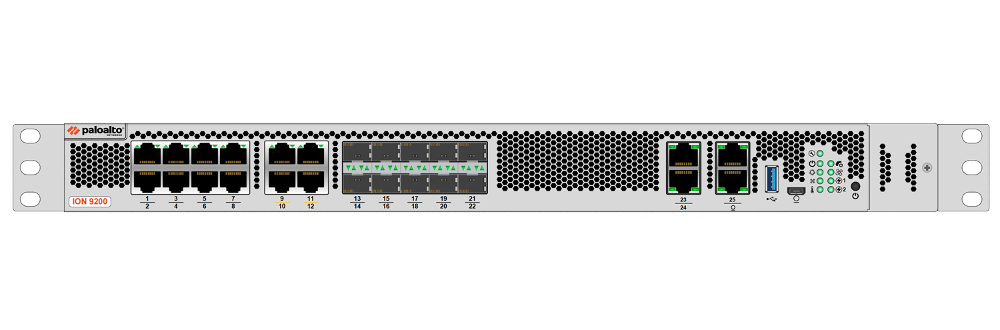
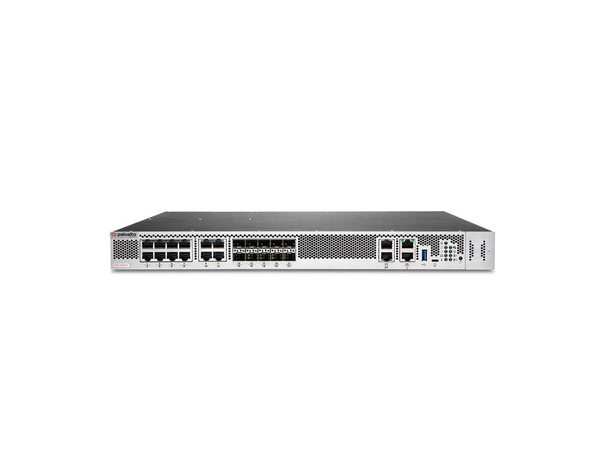
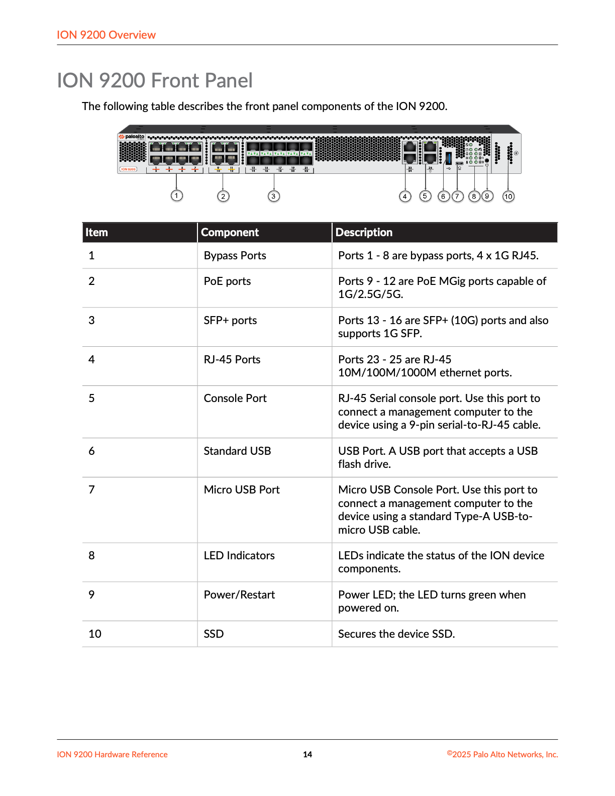
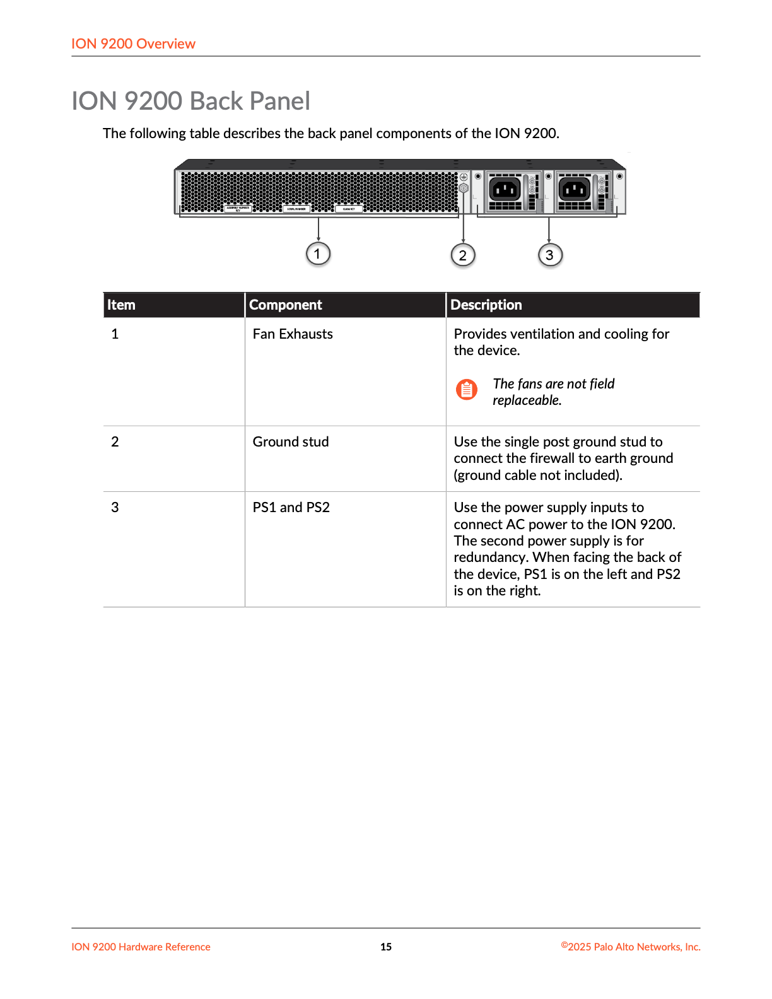
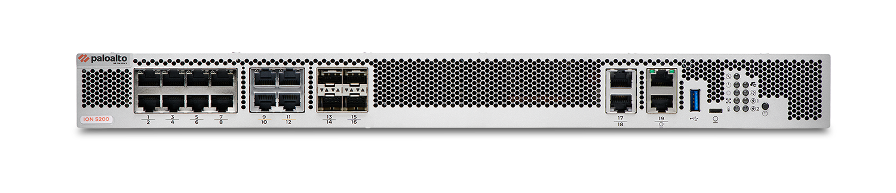
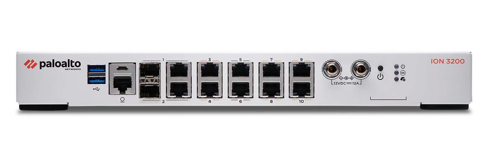
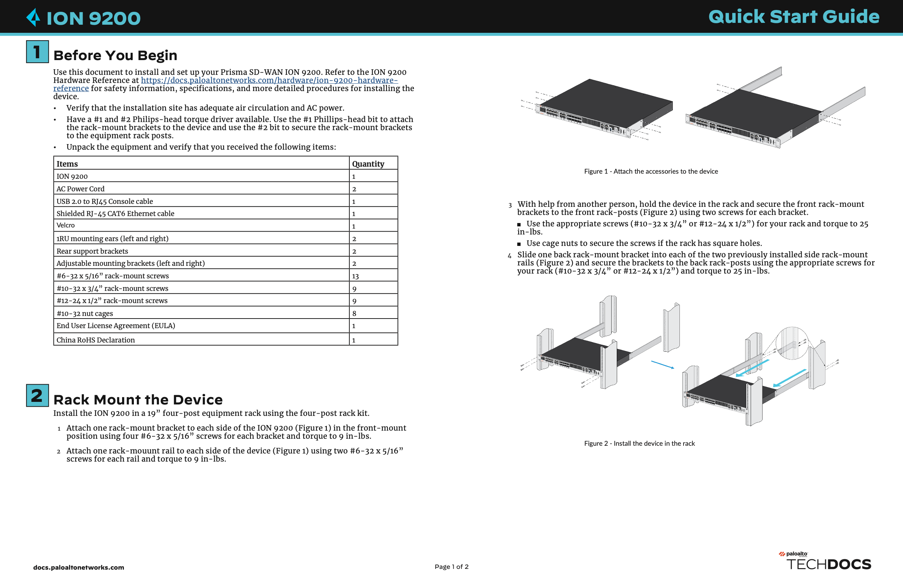
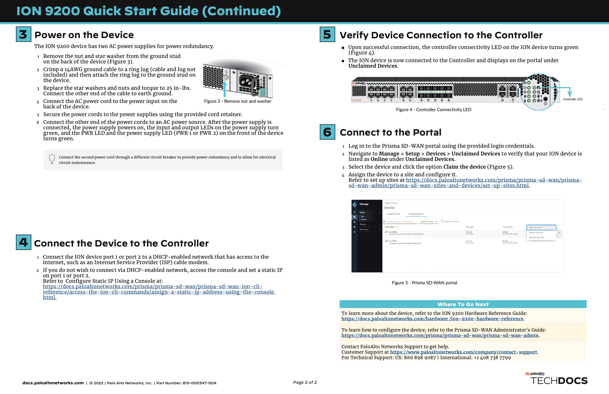
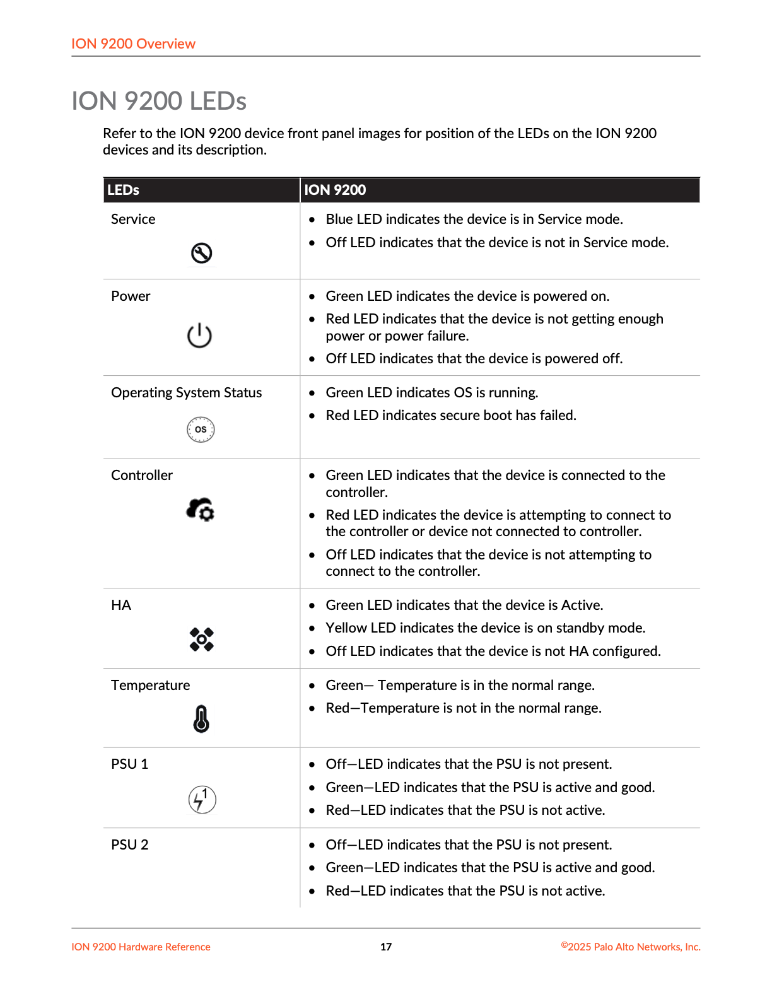

# Knowledge Base Article: Palo Alto Networks Prisma SD-WAN ION 9200

| Field | Value |
| --- | --- |
| **Article ID** | KB-ION-9200-001 |
| **Product** | Prisma SD-WAN Instant-On Network (ION) 9200 |
| **Category** | Hardware / SD-WAN / SASE Edge |
| **Audience** | Network engineers, SASE architects, field engineers, support |
| **Last updated** | 2026-07-16 |
| **Sources** | Official Hardware Reference (Dec 2025), ION Device Specifications datasheet, Quick Start Guide, EOL/EOS announcements, TechDocs |

---

## Table of Contents

1. [Executive Summary](#1-executive-summary)
2. [Product Identity & Naming](#2-product-identity--naming)
3. [Positioning in the Prisma SD-WAN Portfolio](#3-positioning-in-the-prisma-sd-wan-portfolio)
4. [Device Imagery](#4-device-imagery)
5. [Hardware Overview](#5-hardware-overview)
6. [Performance Specifications](#6-performance-specifications)
7. [Front Panel — Ports, Controls & SSD](#7-front-panel--ports-controls--ssd)
8. [Back Panel — Power, Ground & Cooling](#8-back-panel--power-ground--cooling)
9. [LED Indicators](#9-led-indicators)
10. [Physical, Power & Environmental Specs](#10-physical-power--environmental-specs)
11. [Variants, SKUs & Related Platforms](#11-variants-skus--related-platforms)
12. [Software, Licensing & Security Features](#12-software-licensing--security-features)
13. [High Availability](#13-high-availability)
14. [Installation & Rack Mount](#14-installation--rack-mount)
15. [Power-On, Restart & Shutdown](#15-power-on-restart--shutdown)
16. [Controller Claim & Onboarding](#16-controller-claim--onboarding)
17. [SSD Field Replacement (FRU)](#17-ssd-field-replacement-fru)
18. [Lifecycle: Predecessor, EOS & Support](#18-lifecycle-predecessor-eos--support)
19. [Compliance & Safety](#19-compliance--safety)
20. [Operational Best Practices](#20-operational-best-practices)
21. [Quick Reference Cheatsheet](#21-quick-reference-cheatsheet)
22. [Official Documentation Links](#22-official-documentation-links)
23. [Document Control & Disclaimers](#23-document-control--disclaimers)

---

## 1. Executive Summary

The **Prisma SD-WAN ION 9200** is Palo Alto Networks’ **large-tier** Instant-On Network (ION) hardware appliance for **enterprise large branch, large campus, remote office, and data center** SD-WAN sites.

It is a **1U multigigabit** edge device with:

- Up to **15 Gbps** encrypted throughput (data center role)
- Up to **7.5 Gbps** encrypted throughput (branch role)
- **10× 10G/1G SFP+**, **4× multi-gig PoE++**, **8× 1G fail-to-wire bypass** ports
- **Dual hot-swappable 450 W** PSUs
- **64 GB** RAM and dual **480 GB** storage (internal + field-replaceable NVMe)
- Cloud-managed operation via the **Prisma SD-WAN controller**
- Integrated **zone-based firewall (ZBFW)** and optional branch security services

**Important:** The ION 9200 is **not** a PAN-OS next-generation firewall (there is no “PA-9200 series NGFW”). It runs Prisma SD-WAN ION software and is claimed/managed from the Prisma SD-WAN cloud (or on-premises controller). Some internal/docs shorthand may refer to it as “PA-9200.”

---

## 2. Product Identity & Naming

| Term | Meaning |
| --- | --- |
| **ION** | Instant-On Network — Prisma SD-WAN CPE family |
| **ION 9200** | Large hardware model (branch **or** data center role on the same SKU) |
| **PAN-ION-9200 / PAN-ION-9200-HW** | Common hardware appliance ordering SKUs |
| **PAN-ION-9200-SSD-480G** | Field-replaceable external 480 GB NVMe SSD spare |
| **“PA-9200”** | Informal/docs shorthand sometimes seen in release notes; **not** a PAN-OS PA-series firewall |

**What it is:** Prisma SD-WAN application-aware SD-WAN edge / hub appliance with L7 policies, VPN fabric, ZBFW, and SASE integration.

**What it is not:** A Strata/PAN-OS hardware NGFW (compare PA-5400 / PA-7500 for that class of product).

---

## 3. Positioning in the Prisma SD-WAN Portfolio

### Hardware portfolio (by size)

| Tier | Models | Typical use |
| --- | --- | --- |
| **Small** | ION 1200 / 1200-S series, ION 3200 / 3200H | Small branch, ATM/kiosk, hardened |
| **Medium** | ION 5200 | Large branch / DC mid-tier |
| **Large** | **ION 9200** | Large branch, campus, high-capacity DC |

### Official datasheet placement

- **Branch — Large:** ION 9200  
- **Data Center — Large:** ION 9200  

The **same physical appliance** is assigned either a **branch** or **data center** site role in the controller. Performance ratings differ by role (see [§6](#6-performance-specifications)).

### Design goals (vendor positioning)

- Accelerate **SASE** deployment into the data center using WAN connectivity without bolting on extra CPE solely for SD-WAN fabric entry  
- Multigigabit copper (including multi-gig PoE++) and fiber (SFP+) for smart SFPs, APs, cellular gateways, IP phones/cameras  
- Fail-to-wire **bypass** for high-availability path continuity on selected copper pairs  
- Cloud-centric zero-touch style onboarding with controller claim

---

## 4. Device Imagery

### 4.1 Official product photography (front)



*Figure 1. Official Palo Alto Networks press-kit product photo — ION 9200 front. Source: Palo Alto Networks Press Kit.*

### 4.2 Angled / retail product view



*Figure 2. Angled view of the ION 9200 1U chassis (product photography).*

### 4.3 Front panel callout diagram (Hardware Reference)



*Figure 3. Front panel components (Hardware Reference). Numbered callouts are detailed in [§7](#7-front-panel--ports-controls--ssd).*

### 4.4 Back panel callout diagram (Hardware Reference)



*Figure 4. Back panel — fan exhaust, ground stud, dual AC PSU inlets (Hardware Reference).*

### 4.5 Portfolio context — ION 5200 (medium peer)



*Figure 5. ION 5200 (medium large branch/DC peer platform) for visual/size comparison. Source: Press Kit.*

### 4.6 Portfolio context — ION 3200 (small tier)



*Figure 6. ION 3200 (small enterprise branch/DC class) for portfolio comparison. Source: Press Kit.*

### 4.7 Quick Start rack & install illustrations



*Figure 7. Quick Start Guide page 1 — packing list and four-post rack mounting steps.*



*Figure 8. Quick Start Guide page 2 — grounding/power, controller connect, claim, and portal assign.*

---

## 5. Hardware Overview

### 5.1 Form factor

| Attribute | Value |
| --- | --- |
| **Chassis** | 1 RU rack-mount |
| **Mount** | **Four-post** rack kit (front + rear support) |
| **Dimensions (L × W × H)** | **14.15″ × 17.15″** (datasheet also lists **17.12″** width) **× 1.70″** |
| **Weight** | **15.5 lb (7 kg)** |
| **Airflow** | Front (network ports) → rear (PSUs) forced air |
| **Fans** | **4× fixed** fans (**not** field-replaceable) |

### 5.2 Compute & storage

| Resource | Specification |
| --- | --- |
| **Memory (RAM)** | **64 GB** |
| **Internal flash** | **480 GB** |
| **External FRU SSD** | **480 GB** field-replaceable **NVMe** SSD (front bay) |
| **SSD spare SKU** | **PAN-ION-9200-SSD-480G** |
| **SSD hot-swap** | **No** — power off required; certified FSE recommended |
| **RMA note** | Return **whole SSD module (carrier + drive)** for RMA |

### 5.3 Default port behavior

- Ethernet ports **1–22** (and associated management/network ports as labeled) are available as WAN/LAN Ethernet  
- By default, ports are **DHCP-enabled**  
- **Ports 1 and 2** are the usual first choices for **internet / controller reachability**  
- Console available via **RJ-45 serial** and **Micro-USB**

### 5.4 Console access

| Method | Details |
| --- | --- |
| **RJ-45 console** | UART serial; use 9-pin serial-to-RJ-45 cable |
| **Micro-USB console** | Type-A USB → micro-USB cable |
| **Baud rate (ION family)** | Commonly **115200** for ION AUX/console (confirm per current admin guide) |
| **USB Type-A** | Flash drive (not a second console) |

---

## 6. Performance Specifications

> **Measurement notes (from Prisma SD-WAN ION Device Specifications datasheet):**  
> - Throughput measured with **encrypted 1,400-byte packets** on Prisma SD-WAN **6.5.1** (as of **2025-02-01** in datasheet footnotes; numbers subject to change by software train).  
> - Branch throughput dagger (†) measured with **2 VPN tunnels**.  
> - Threat prevention measured with best-practices profile using **SD-WAN appmix** and direct internet.  
> - **DC VPN scale** for ION 9200: **5,000**.

### 6.1 Core performance table (ION 9200)

| Metric | Branch role | Data center role |
| --- | --- | --- |
| **Encrypted throughput (1,400 B)** | **7.5 Gbps** † | **15 Gbps** |
| **Threat prevention (appmix)** | **4.5 Gbps** | (branch figure published; use design validation for DC TP) |
| **Flows per second** | **20K** | **65K** |
| **Concurrent flows** | **1M** | **1M** |
| **DC VPN scale** | — | **5,000** |

† Branch encrypted throughput with 2 VPN tunnels (datasheet footnote).

### 6.2 Comparison within large/medium hardware class

| Model | Role tier | Encrypted thr. (1,400 B) | Threat prev. (branch appmix) | Flows/s | Concurrent flows | DC VPN scale | Bypass pairs |
| --- | --- | --- | --- | --- | --- | --- | --- |
| **ION 5200** | Medium | 4 Gbps DC / 3.2 Gbps branch | 1.3 Gbps | 16K DC / 8.5K br | 100K DC / 100K br | 2,000 | 2 |
| **ION 9200** | **Large** | **15 Gbps DC / 7.5 Gbps br** | **4.5 Gbps** | **65K DC / 20K br** | **1M / 1M** | **5,000** | **4** |

*(PA-5440 appears on the same datasheet table as an NGFW comparison column only — different product class.)*

### 6.3 Historical / alternate published numbers

Some older partner datasheets listed slightly lower figures (e.g. ~14 Gbps DC / 5 Gbps branch). Always prefer the **current official ION Device Specifications PDF** for capacity planning. Reseller listings may also show 600-byte packet numbers (e.g. ~6 Gbps DC / ~3 Gbps branch class figures) — treat those as secondary.

---

## 7. Front Panel — Ports, Controls & SSD


*Figure 9. Front panel map (repeat of Figure 3 for section reference).*

### 7.1 Callout map

| # | Component | Description |
| --- | --- | --- |
| **1** | **Bypass ports** | Ports **1–8**, **1G RJ-45**, arranged as **4 fail-to-wire pairs** |
| **2** | **PoE multi-gig ports** | Ports **9–12**, **1G / 2.5G / 5G** **PoE++ (802.3bt)**; yellow bar between port numbers |
| **3** | **SFP+ ports** | Ports **13–22**, **10G/1G** SFP+ (10 ports); higher-power SFP+ for smart SFPs |
| **4** | **Additional RJ-45** | Ports **23–25**, **10M/100M/1000M** Ethernet |
| **5** | **RJ-45 console** | Serial management console |
| **6** | **USB Type-A** | USB flash storage |
| **7** | **Micro-USB console** | Alternate console |
| **8** | **Status LED bank** | Service, Power, OS, Controller, HA, Temp, PSU1/2, Fan, etc. |
| **9** | **Power / Restart** | Front power control + power LED (green when on) |
| **10** | **SSD bay** | Secures the external field-replaceable NVMe SSD |

### 7.2 Port inventory summary

| Port class | Count | Speed | Notes |
| --- | --- | --- | --- |
| **1G RJ-45 bypass** | 8 (ports 1–8) | 1G | **4 pairs:** 1–2, 3–4, 5–6, 7–8 |
| **Multi-gig PoE++** | 4 (ports 9–12) | 1 / 2.5 / 5G | **150 W system budget**, **90 W max per port**, 802.3bt |
| **SFP+** | 10 (ports 13–22) | 10G / 1G | Fiber / smart SFP friendly |
| **1G RJ-45 (non-bypass)** | 3 (ports 23–25) | 10/100/1000 | Completes **11× 1G RJ-45** copper total with bypass set |
| **Console RJ-45** | 1 | Serial | Management |
| **Micro-USB console** | 1 | USB console | Management |
| **USB-A** | 1 | Host USB | Flash drive |

**Copper 1G total:** 8 bypass + 3 standard = **11× 1G RJ-45** (matches hardware specs table).

### 7.3 Bypass pairs (fail-to-wire)

| Pair | Ports |
| --- | --- |
| Pair 1 | 1–2 |
| Pair 2 | 3–4 |
| Pair 3 | 5–6 |
| Pair 4 | 7–8 |

Bypass provides electrical continuity if the appliance loses power or is failed out of path (design carefully for production HA topologies).

### 7.4 PoE++ details

| Attribute | Value |
| --- | --- |
| **Standard** | **802.3bt PoE++** |
| **Ports** | 9–12 (MGig) |
| **System power budget** | **150 W** total PoE |
| **Per-port max** | **90 W** |
| **Typical loads** | Cellular gateways, Wi-Fi APs, IP phones, cameras |

Plan PD power draw so total simultaneous PoE load stays within **150 W**.

---

## 8. Back Panel — Power, Ground & Cooling


*Figure 10. Back panel components.*

| # | Component | Description |
| --- | --- | --- |
| **1** | **Fan exhausts** | Rear exhaust for front-to-back cooling. **Fans are not field replaceable.** |
| **2** | **Ground stud** | Single-post chassis ground. Ground cable **not** included. |
| **3** | **PS1 / PS2** | Dual AC inlets for **450 W** PSUs. Facing the rear: **PS1 left**, **PS2 right**. Second supply is redundancy. |

### Grounding (Quick Start)

1. Remove nut and star washer from ground stud.  
2. Crimp **14 AWG** ground cable to ring lug (cable/lug not included).  
3. Attach ring lug; reinstall star washer + nut; torque to **25 in-lbs**.  
4. Bond other end to earth ground.

### Power cabling tips

- Connect both PSUs to **independent circuit breakers** when possible for true power redundancy and maintenance isolation.  
- Use provided cord retainers.  
- Confirm AC is **100–240 V, 50–60 Hz**.

---

## 9. LED Indicators



*Figure 11. Official LED status table (Hardware Reference, partial page).*

### 9.1 System LEDs

| LED | States |
| --- | --- |
| **Service** | **Blue** = Service mode; **Off** = not in Service mode |
| **Power** | **Green** = powered on; **Red** = insufficient power / power failure; **Off** = powered off |
| **Operating System Status** | **Green** = OS running; **Red** = **secure boot failed** |
| **Controller** | **Green** = connected to controller; **Red** = attempting / not connected; **Off** = not attempting connection |
| **HA** | **Green** = Active; **Yellow** = Standby; **Off** = HA not configured |
| **Temperature** | **Green** = normal; **Red** = out of range |
| **PSU 1 / PSU 2** | **Off** = PSU not present; **Green** = active/good; **Red** = not active |
| **FAN** | **Green** = OK; **Red** = service required / fan failure |

### 9.2 Port link LEDs (PHY controlled)

| Port type | Indication |
| --- | --- |
| **10G SFP+** | Speed/activity: **Yellow = 1 Gbps**, **Green = 10 Gbps** |
| **1G / MGig RJ-45** | Activity LED green on / blinking |

### 9.3 Field triage tips

| Symptom | First checks |
| --- | --- |
| Controller LED red | WAN path, DHCP/DNS, firewall to controller, claim status |
| OS LED red | Secure boot / hardware integrity — escalate TAC; do not ignore |
| Power red | PSU seating, AC feed, power budget, dual-PSU status LEDs |
| Fan red | Intake blockage, ambient temp, escalate (fans not FRU) |
| HA off | Expected if single appliance; if pair expected, check HA config |

---

## 10. Physical, Power & Environmental Specs

### 10.1 Power

| Attribute | Specification |
| --- | --- |
| **PSU count** | **2×** plug-in **450 W** |
| **Input** | **AC 100–240 V, 50–60 Hz** |
| **Redundancy** | **1+1**, FRU, **hot-swappable** |
| **Ship config** | Device ships with **2× 450 W** PSUs installed |

### 10.2 Cooling

| Attribute | Specification |
| --- | --- |
| **Type** | Forced air |
| **Fans** | **4 fixed** (not FRU) |
| **Direction** | Front (ports) → rear (PSUs) |

### 10.3 Environment

| Condition | Range |
| --- | --- |
| **Operating temperature** | **32–104 °F (0–40 °C)** (incl. notes for ~3000 m altitude) |
| **Storage temperature** | **−4–158 °F (−20–70 °C)** |
| **Operating humidity** | **5–90%** non-condensing |
| **Storage humidity** | **5–95%** non-condensing |
| **MTBF** | **10 years** (datasheet) |

### 10.4 Mechanical / install

| Attribute | Specification |
| --- | --- |
| **Rack** | 19″ **four-post** |
| **Chassis torque (bracket to device)** | **#6-32 × 5/16″** screws @ **9 in-lbs** |
| **Rack post torque** | **#10-32 × 3/4″** or **#12-24 × 1/2″** @ **25 in-lbs** (cage nuts for square holes) |

---

## 11. Variants, SKUs & Related Platforms

### 11.1 Hardware “variants” of the ION 9200

Unlike the ION 1200 family (multiple cellular regional SKUs) or ION 3200H (hardened/cellular variants), the **ION 9200 is a single primary hardware platform**. “Variants” in practice mean:

| Variant dimension | Options | Notes |
| --- | --- | --- |
| **Site role** | Branch site vs Data Center site | Same SKU; different performance ratings & licensing expectations |
| **HA pair** | Standalone vs dual-ION HA | Same hardware model, two appliances |
| **Security posture** | Standard vs FIPS-related kits (where offered) | FIPS kits called out for ION-5200/9200 class in price lists |
| **Storage FRU** | Base SSD vs replaced **PAN-ION-9200-SSD-480G** | External NVMe bay |
| **Regional AC cords** | Country-specific power cords in kit | Hardware identical |

There is **no** separate “ION 9200H” or “ION 9200-5G” model in the public portfolio tables used for this article.

### 11.2 Common SKUs & accessories

| SKU / item | Purpose |
| --- | --- |
| **PAN-ION-9200 / PAN-ION-9200-HW** | Main hardware appliance |
| **PAN-ION-9200-SSD-480G** | 480 GB external NVMe FRU SSD |
| **Regional AC power cords** | Included (region-dependent) |
| **Four-post rack kit** | Included with appliance kit |
| **Shielded RJ-45 CAT6 cable** | Included (1×) |
| **FIPS mechanical kit** (if ordered) | Front cover / FIPS mechanical components for 5200/9200 class (confirm current BOM with account team) |

### 11.3 Predecessor: ION 9000

| Topic | Detail |
| --- | --- |
| **Predecessor** | **ION 9000** (large branch / data center) |
| **EOS announcement** | 18 Dec 2023 |
| **EOS date (ION 9000)** | **15 June 2024** |
| **Hardware EOL support (ION 9000)** | Through **1 August 2029** (with valid support contract; per EOL policy) |
| **Official upgrade path** | **ION 9000 → ION 9200** |
| **Industry view** | 9200 is the evolution of the 90xx large platform (higher density modern IO, PoE++, FRU SSD, updated mechanicals) |

### 11.4 Peer hardware (same generation family)

| Model | Tier | Encrypted thr. (1,400 B) | PoE | Bypass | Notes |
| --- | --- | --- | --- | --- | --- |
| ION 3200 / 3200H | Small | ~1.4–1.7 Gbps DC class | Yes (model-dependent) | 1 pair | Hardened/cellular options on 3200H |
| ION 5200 | Medium | 4 / 3.2 Gbps | Yes (4× MGig PoE++) | 2 pairs | Closest step-down from 9200 |
| **ION 9200** | **Large** | **15 / 7.5 Gbps** | **Yes (4× MGig PoE++)** | **4 pairs** | Flagship large ION |

### 11.5 Virtual (software) ION models — portfolio alternatives, not 9200 SKUs

Virtual IONs are **not** hardware variants of the 9200, but are alternatives for cloud/hypervisor sites:

| Virtual model | Typical use | Published throughput (datasheet class) | vCPU | RAM | Disk |
| --- | --- | --- | --- | --- | --- |
| ION 3102V | Remote office | Up to 100 Mbps | 2 | 8 GB | 40 GB |
| ION 3104V | Remote office | Up to 200 Mbps | 4 | 8 GB | 40 GB |
| ION 3108V | Remote office | Up to 350 Mbps | 8 | 8 GB | 40 GB |
| ION 7108V | Data center | Up to 3 Gbps | 8 | 32 GB | 100 GB |
| ION 7116V | Data center | Up to 10 Gbps | 16 | 64 GB | 100 GB |

Platforms: ESXi, Hyper-V, KVM; DC models also Azure / AWS / Google Cloud.

### 11.6 Cellular note

**ION 9200 has no built-in cellular radio.** For LTE/5G at large sites, use **external cellular gateways** powered via **PoE++** or connected via Ethernet/SFP.

---

## 12. Software, Licensing & Security Features

### 12.1 Operating model

- Managed primarily from the **Prisma SD-WAN multitenant cloud controller** (or on-premises controller deployments where applicable).  
- Modes of operation include **analytics mode** and full **control mode** (policy-driven path selection, security, routing functions integrated on-device).  
- Encryption keys are **customer- and device-specific**, with high-frequency rotation across mesh / hub-and-spoke fabrics (vendor FIPS/security baseline messaging).

### 12.2 Software version guidance

- Large current-gen models (**1200-S, 3200, 5200, 9200**) were introduced / recommended on modern **6.1.x** trains and later.  
- Always follow **current Palo Alto recommended software trains** and release notes for your controller version.  
- Field replaceable unit features for 9200 have had explicit software prerequisites in release notes (historically **6.2.x** class for FRU features — verify in the release notes for your train).  
- Upgrade rule of thumb for fabrics: upgrade **data center IONs before branch IONs** when release notes require DC minimum versions.

### 12.3 Subscriptions (device requires license for operational use)

Prisma SD-WAN customers typically choose among:

- **Per-device** subscription (Small / Medium / **Large**)  
- **Per-branch site** subscription (Small / Medium / **Large**)  
- **Aggregate bandwidth** subscription (Mbps quantity)

**Data center rule:** purchase a **data center subscription for each ION** (physical or virtual) assigned to a DC site.

Optional licenses commonly paired:

- **Network DVR** — up to 90 days retention of stats/policy/config/alarms (licensed per ION)  
- **WCR Report** license — utilization/hotspot/AIOps-style reporting packages  

### 12.4 Security capabilities on ION

| Capability | Description |
| --- | --- |
| **Zone-Based Firewall (ZBFW)** | Application-based, policy-centric branch perimeter / segmentation |
| **Threat Prevention** | Anti-malware / vulnerability-style protections for east-west & guest use cases |
| **DNS Security** | C2 / DNS tunneling detection via cloud DNS analysis |
| **URL Filtering** | Category-based web control |
| **Prisma Access integration** | Extend consistent SASE security to cloud edge |

These are **ION security services**, not full PAN-OS App-ID/Content-ID parity with a PA-series NGFW — design SASE architectures accordingly.

### 12.5 Cryptographic baseline

- ION family marketed with **FIPS** security baseline (FIPS **140-2 / 140-3** messaging varies by document generation; NIST CMVP materials exist for ION cryptographic modules).  
- Confirm validated module version against your compliance program.

---

## 13. High Availability

- Prisma SD-WAN ION **HA** is designed so a branch can **survive device failure while preserving 100% of WAN capacity** (vendor HA messaging — validate topology against design guide).  
- Front-panel **HA LED**: Green = Active, Yellow = Standby, Off = not HA-configured.  
- For path continuity independent of HA pair state, leverage **bypass pairs** on critical copper inline segments.  
- Best practice: dual PSU feeds + HA pair + diverse WAN circuits for large/campus/DC sites.

---

## 14. Installation & Rack Mount

### 14.1 What’s in the box (installation kit)

From Hardware Reference / Quick Start:

| Item | Qty |
| --- | --- |
| ION 9200 device (with 2× 450 W PSU) | 1 |
| AC power cords (region-specific) | 2 |
| USB 2.0 to RJ-45 console cable (QS list) / management cabling | 1 |
| Shielded RJ-45 CAT6 Ethernet cable | 1 |
| Velcro (QS list) | 1 |
| 1RU mounting brackets (L/R) | 2 |
| Rear support brackets | 2 |
| Adjustable mounting rails/brackets (L/R) | 2 |
| **#6-32 × 5/16″** screws | 13 |
| **#10-32 × 3/4″** screws | 9 |
| **#12-24 × 1/2″** screws | 9 |
| **#10-32** cage nuts | 8 |
| EULA / Limited Warranty / China RoHS sheet | included |

Tools: **#1 and #2 Phillips** bits; torque driver preferred.

### 14.2 Four-post rack procedure (summary)

1. Attach one **front rack-mount bracket** per side using **four #6-32 × 5/16″** screws each @ **9 in-lbs**.  
2. Attach one **side rail** per side using **two #6-32 × 5/16″** screws each @ **9 in-lbs**.  
3. Seat device in rack; secure front brackets to front posts with **two screws each** (`#10-32 × 3/4″` or `#12-24 × 1/2″`) @ **25 in-lbs** (cage nuts for square holes).  
4. Slide rear brackets into side rails; secure to rear posts with appropriate screws @ **25 in-lbs**.  

See Figures 7–8 for vendor illustrations.

### 14.3 Site prerequisites

- Adequate front-to-back airflow  
- Dual AC circuits preferred  
- DHCP + internet path for first boot (or static IP plan)  
- Physical access planned if remote `debug shutdown` is used  

---

## 15. Power-On, Restart & Shutdown

### 15.1 Power on

1. Ground the chassis.  
2. Connect PS1 and PS2 AC cords; secure retainers.  
3. Apply power — **Power LED turns green**.  
4. Confirm PSU1/PSU2 LEDs green; fans spin; OS LED progresses to green.

### 15.2 Restart

- Press the **power switch three times** (each press-and-hold ~**1 second**, then release) to **restart**.

### 15.3 Shutdown

| Method | Action |
| --- | --- |
| **CLI toolkit** | `debug shutdown` — ensure physical access to power back on |
| **Power switch** | Press and hold **> 5–8 seconds**, then release |

### 15.4 Power back on after orderly shutdown

- Click/press the power switch **once** to power the device on again.

---

## 16. Controller Claim & Onboarding

### 16.1 Connect for controller reachability

1. Connect **port 1 or port 2** to a **DHCP-enabled** network with internet (or path to controller).  
2. Optionally set static IP via console if DHCP is unavailable.  
3. Watch **Controller LED** → **green** when connected.  
4. Device appears under **Unclaimed Devices** in the portal.

### 16.2 Claim & assign (portal)

1. Log in to Prisma SD-WAN portal.  
2. Navigate to **Manage → Setup → Devices → Unclaimed Devices** (wording may vary slightly by UI version).  
3. Select device → **Claim**.  
4. **Assign** to a **Branch** or **Data Center** site and complete interface/circuit/policy config.  

Claiming installs a **Customer Installed Certificate (CIC)** and legitimizes the device in the tenant.

### 16.3 On-premises controller bootstrap (when applicable)

Options typically include:

- Static host entry for bootstrap name (e.g. `bootstrap.prismasdwan.internal`)  
- DNS record for bootstrap hostname  
- DHCP VCI **`PRISMASDWANION`**  

Follow the current *Connect the Device to the On-Premises Controller* TechDocs workflow for exact syntax.

---

## 17. SSD Field Replacement (FRU)

> **Not hot-swappable.** Use ESD protection. Palo Alto recommends a **certified Field Service Engineer**. RMA the **entire SSD module (carrier + drive)**.

### 17.1 Procedure

1. Disable FRU partition:  
   `log-fru disable`  
   *(device reboots)*  
2. **Power off** the device fully.  
3. Remove old external SSD; insert replacement **PAN-ION-9200-SSD-480G**.  
4. Power on.  
5. Initialize FRU partition:  
   `log-fru init`  
   *(device reboots)*  
6. Verify:  
   `dump disk info`

### 17.2 Example `dump disk info` layout (illustrative from docs)

Typical mounts after healthy init include internal NVMe (`nvme1n1…`) volumes for root/config/log/boot and external FRU (`nvme0n1…`) mounted at **`/frulog`** (~hundreds of GB). Exact sizes may vary slightly by image.

---

## 18. Lifecycle: Predecessor, EOS & Support

| Product | EOS | Hardware support thru (policy) | Replacement |
| --- | --- | --- | --- |
| **ION 3000** | 15 Mar 2024 | 1 Aug 2029 | ION **3200** |
| **ION 9000** | 15 Jun 2024 | 1 Aug 2029 | **ION 9200** |
| **ION 9200** | Active (EOL date **TBD** on hardware EOL page as of research date) | — | Current large platform |

Always re-check [Hardware End-of-Life Dates](https://www.paloaltonetworks.com/services/support/end-of-life-announcements/hardware-end-of-life-dates) before purchase or refresh planning.

---

## 19. Compliance & Safety

### 19.1 Certifications (hardware specs)

- **IEC 62368-1**, **cTUVus**  
- **FCC & CE Class A**  
- **TEC**, **KCC**  
- Additional regional statements: **VCCI-A**, **UKCA**, **ICES-003 Class A**, Taiwan RoHS marking, etc.

### 19.2 Key safety / install rules

- Wear **ESD strap** when handling FRUs or exposed circuits.  
- Use **grounded/shielded Ethernet** where required for EMC.  
- WAN/LAN copper ports are for **intra-building** Ethernet — **not** PSTN and **not** OSP-rated for outside plant copper.  
- Optical interfaces comply with applicable laser safety rules (21 CFR 1040.10 / 1040.11 class messaging).  
- Dual-PSU appliances: disconnect **all** power cords before full de-energization.  
- Battery: risk of explosion if replaced with wrong type; dispose per local law.  
- Ambient operating limit for UL statement: **0–40 °C**.

### 19.3 Third-party components

Third-party optics, PSUs, or SSDs outside Palo Alto support policy may void support — see Palo Alto **Third-Party Component Support** statement before deploying non-approved FRUs.

---

## 20. Operational Best Practices

1. **Capacity plan** using **branch vs DC** role numbers, not a single “15 Gbps” assumption for every site.  
2. Put controller connectivity on **port 1/2** with DHCP first; then lock statics if required.  
3. Use **both PSUs** on diverse circuits.  
4. For inline copper critical paths, map **bypass pairs** deliberately and test fail-to-wire behavior in a maintenance window.  
5. Track **PoE budget** (150 W system / 90 W port).  
6. Monitor **Controller, HA, Fan, Temp, PSU** LEDs during cutovers.  
7. Keep DC ION software **ahead of or equal to** branch requirements during upgrades.  
8. Treat **secure boot red** and **fan red** as priority incidents.  
9. Document site role, circuits, HA partner serial, and FRU SSD serials in CMDB.  
10. Prefer official optics and SSD SKUs for RMA simplicity.

---

## 21. Quick Reference Cheatsheet

```
MODEL ........ ION 9200 (Prisma SD-WAN large)
SKU .......... PAN-ION-9200 / PAN-ION-9200-HW
SSD FRU ...... PAN-ION-9200-SSD-480G
ROLE ......... Branch OR Data Center (controller assignment)
RU ........... 1U four-post
SIZE ......... 14.15" x ~17.15" x 1.70"   WT 15.5 lb
RAM .......... 64 GB
STORAGE ...... 480G internal + 480G external NVMe
PSU .......... 2x 450W AC, hot-swap 1+1
FANS ......... 4 fixed (non-FRU), F→B airflow

PORTS
  1-8   ...... 1G RJ45 BYPASS (pairs 1-2,3-4,5-6,7-8)
  9-12  ...... MGig 1/2.5/5G PoE++ 802.3bt (150W sys / 90W port)
  13-22 ...... SFP+ 10G/1G (x10)
  23-25 ...... 1G RJ45
  CONSOLE .... RJ45 + Micro-USB
  USB-A ...... x1

PERF (encrypted 1400B, datasheet)
  DC ......... 15 Gbps | 65K fps | 1M flows | 5000 VPN
  BR ......... 7.5 Gbps† | 20K fps | 1M flows | TP 4.5 Gbps
  † with 2 VPN tunnels

POWER CTL
  Restart .... power button x3 (1s each)
  Shutdown ... hold 5-8s OR "debug shutdown"
  SSD FRU .... log-fru disable → power off → swap → power on → log-fru init
  Verify ..... dump disk info

ONBOARD
  Cable port1/2 to DHCP internet → Controller LED green
  Portal: Unclaimed → Claim → Assign site (Branch/DC)
```

---

## 22. Official Documentation Links

| Resource | URL |
| --- | --- |
| **ION 9200 Hardware Reference** | https://docs.paloaltonetworks.com/hardware/ion-9200-hardware-reference |
| **Hardware specifications** | https://docs.paloaltonetworks.com/hardware/ion-9200-hardware-reference/ion-9200-overview/ion-9200-hardware-specifications |
| **Front panel** | https://docs.paloaltonetworks.com/hardware/ion-9200-hardware-reference/ion-9200-overview/ion-9200-front-panel |
| **Back panel** | https://docs.paloaltonetworks.com/hardware/ion-9200-hardware-reference/ion-9200-overview/ion-9200-back-panel |
| **LEDs** | https://docs.paloaltonetworks.com/hardware/ion-9200-hardware-reference/ion-9200-overview/ion-9200-leds |
| **SSD replacement** | https://docs.paloaltonetworks.com/hardware/ion-9200-hardware-reference/install-the-ion-9200/replacing-ssd-for-ion-9200 |
| **Four-post install** | https://docs.paloaltonetworks.com/hardware/ion-9200-hardware-reference/install-the-ion-9200/install-the-ion-9200-using-four-post-rack-mount-kit |
| **Quick Start PDF** | https://docs.paloaltonetworks.com/content/dam/techdocs/en_US/pdf/hardware/ion-9200/ion-9200-quick-start.pdf |
| **ION Device Specifications datasheet** | https://www.paloaltonetworks.com/resources/datasheets/prisma-sd-wan-instant-on-network-ion-device-specifications |
| **Claim ION device** | https://docs.paloaltonetworks.com/prisma-sd-wan/administration/prisma-sd-wan-sites-and-devices/set-up-devices/claim-the-ion |
| **Hardware EOL dates** | https://www.paloaltonetworks.com/services/support/end-of-life-announcements/hardware-end-of-life-dates |
| **EOS announcement (ION 3000/9000)** | https://www.paloaltonetworks.com/services/support/end-of-life-announcements/end-of-sale |
| **Press kit product images** | https://www.paloaltonetworks.com/company/press-kit |
| **Visio stencils (Prisma SD-WAN)** | Press Kit → Prisma SD-WAN Microsoft Visio Stencils |

**Support:** Palo Alto Networks Customer Support — https://www.paloaltonetworks.com/company/contact-support  
US Technical Support phone (published on Quick Start): **866 898 9087** | International: **+1 408 738 7799** (verify current numbers on official contact pages).

---

## 23. Document Control & Disclaimers

| Item | Detail |
| --- | --- |
| **Compiled for** | Internal knowledge base / field reference |
| **Accuracy basis** | Public Palo Alto Networks TechDocs, datasheets, and EOL pages as of **2026-07-16** |
| **Not a substitute for** | Official Hardware Reference, release notes, TAC guidance, or contractual datasheets |
| **Performance** | Lab/datasheet conditions; real-world results vary with packet size, features enabled, VPN scale, and software version |
| **Trademarks** | Palo Alto Networks, Prisma, and related marks are trademarks of Palo Alto Networks, Inc. |
| **Images** | Product photos from Palo Alto Networks Press Kit; panel diagrams and Quick Start pages from official documentation used for educational KB purposes |

### Image inventory in this article package

| File | Description |
| --- | --- |
| `images/ion-9200-front.png` | Official front product photo |
| `images/ion-9200-angled.png` | Angled product photo |
| `images/ion-9200-front-panel-diagram.png` | Labeled front panel (HW ref) |
| `images/ion-9200-back-panel-diagram.png` | Labeled back panel (HW ref) |
| `images/ion-9200-leds-page1.png` | LED legend page (HW ref) |
| `images/ion-9200-quickstart-page1.png` | Quick Start p1 (rack/pack list) |
| `images/ion-9200-quickstart-page2.png` | Quick Start p2 (power/claim) |
| `images/ion-5200-front.png` | Peer platform photo |
| `images/ion-3200-front.png` | Smaller-tier portfolio photo |

---

*End of KB article — ION 9200.*
